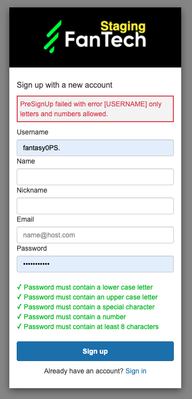

# AWS Cognito Username Check

The objective of this library is to make sure admin username is different
from their password. This is a compliance requirement for some licences.

AWS Cognito allows to choose a different level of password strength. Below options may be required:
- minimum length
- numbers
- special characters
- uppercase letters
- lowercase letters

Thanks to `pre sign-up` trigger and Lambda, we are able to check username
before admin account is created. 
Passwords, however, are not sent to a Lambda function. This is why we need to make
a trick - to require special characters in Cognito password strength options
but return an error from Lambda if username contains them.
This way we make sure a username is different from a password.

### Steps to achieve:
- Enforce special characters in AWS Cognito (`Policies` in console)
- Create a Lambda function with the code from [index.js](index.js)
- Choose created Lambda function as a trigger for `Pre sign-up` event (`Triggers` in console)

If a user tries to create an account with username the same as password, they will see similar error message:

